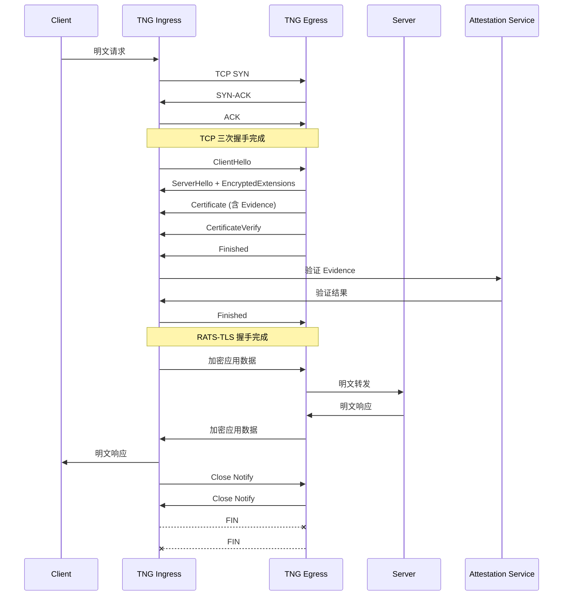
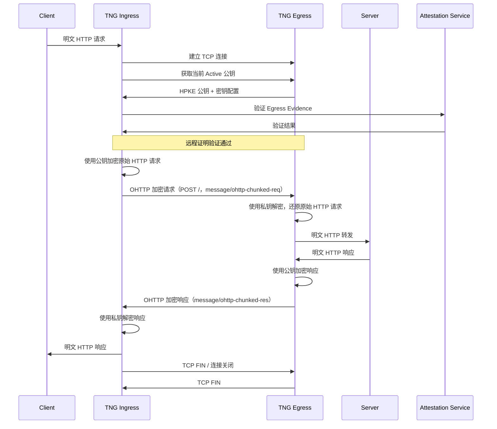

# 阶段一：TNG 核心协议对比 — RATS-TLS 与 OHTTP

> 阅读材料：
> - `docs/architecture_zh.md` / `docs/architecture.md`
> - `docs/configuration_zh.md` / `docs/configuration.md`
> - `docs/scenarios/scenario_vllm_ohttp_cluster_zh.md`
> - `docs/scenarios/scenario_vllm_pd_separation_zh.md`
> - `docs/peer_shared_zh.md` / `docs/peer_shared.md`
>
> 本文档只补充原文未展开或用户要求补充的内容；已有信息尽量通过原文链接或原话摘抄呈现。

---

## 1. 需要预先了解的两个概念

### 1.1 Ingress / Egress（入口 / 出口）

`docs/architecture_zh.md` 中的定义：

> 在 TNG 中我们对安全信道也设计了对应的两个概念：入口（Ingress）和出口（Egress）。主动发起方（Client，客户端）的流量会通过入口（Ingress）进入安全信道，再从出口（Egress）流出到被动响应方（Server，服务端）。
>
> **命名澄清：** TNG 中的 "Ingress" **不是** "流量进入服务器" 的意思（与 Kubernetes Ingress 不同）。它表示流量**进入隧道**——客户端将明文送入 Ingress，Ingress 将其加密并通过隧道发出。Egress 则是隧道的另一端，流量从这里出来后被转发到目标服务。
>
> —— [`docs/architecture_zh.md` § Ingress 与 Egress 介绍](../docs/architecture_zh.md)

### 1.2 远程证明在 TNG 中的作用

`docs/architecture_zh.md` 指出：

> TNG 在远程证明中扮演着核心角色，根据配置可以成为**证明者 (Attester)** 或 **验证者 (Verifier)**。
>
> 当 TNG 被配置为证明者角色时，它负责生成并提供其所在计算环境的“可信凭证”或“证据”（Evidence，证据）。
>
> 当 TNG 被配置为验证者角色时，它负责接收并严格审查来自对端 TNG (Attester) 提供的可信证据。
>
> —— [`docs/architecture_zh.md` § 远程证明](../docs/architecture_zh.md)

---

## 2. RATS-TLS 与 OHTTP 对比表格

该表格综合 `docs/architecture_zh.md` 与 `docs/configuration_zh.md` 中的描述。

| 维度 | RATS-TLS（Remote ATtestation ProcedureS for Transport Layer Security，基于远程证明流程的传输层安全协议） | OHTTP（Oblivious HTTP，无感知 HTTP） |
|---|---|---|
| **工作层级** | 传输层（TCP，Transmission Control Protocol，传输控制协议） | 会话层 / HTTP（HyperText Transfer Protocol，超文本传输协议） 应用层 |
| **协议基础** | TLS 1.3（Transport Layer Security，传输层安全） + 远程证明证据 | OHTTP（RFC 9458），基于 HPKE（Hybrid Public Key Encryption，混合公钥加密） |
| **承载流量** | 任意 TCP 流量（HTTP、数据库、RPC 等） | 仅限 HTTP 流量 |
| **负载均衡兼容** | 4 层 LB（Load Balancer，负载均衡器） | 7 层 LB（Load Balancer，负载均衡器） |
| **默认状态** | TNG（Trusted Network Gateway，可信网络网关）默认协议 | 需在 Ingress/Egress 显式配置 `ohttp` 字段 |
| **典型场景** | 数据库连接、内部 RPC（Remote Procedure Call，远程过程调用）、任意 TCP 应用 | RESTful API（Representational State Transfer API，表述性状态传递 API）、浏览器 SDK（Software Development Kit，软件开发工具包）、推理 API、隐私请求 |
| **与生成式 AI 的典型结合** | vLLM P/D（Prefill/Decode，预填充/解码）分离中的 KV cache（Key-Value cache，键值缓存）传输加密 | vLLM 推理集群的提示词加密与 7 层网关兼容 |
| **配置字段** | `rats_tls`（可选 `multiplex`，多路复用） | `ohttp`（可选 `path_rewrites` / `cors` / `key`） |

> 来源：
> - `docs/architecture_zh.md` § [加密协议与安全性](../docs/architecture_zh.md)
> - `docs/configuration_zh.md` § [RatsTlsArgs](../docs/configuration_zh.md) / [OHTTP 协议](../docs/configuration_zh.md)

---

## 3. RATS-TLS 详细介绍

### 3.1 协议原理

#### 3.1.1 名称来源与 RA-TLS / RATS-TLS 区别

- **RATS** 是 **Remote ATtestation ProcedureS**（Remote：远程；ATtestation：证明；ProcedureS：流程/程序）的缩写，即 IETF RFC 9334 中定义的远程证明体系架构。
- **RATS-TLS** 即 **Remote ATtestation ProcedureS for Transport Layer Security**（基于远程证明流程的传输层安全协议），指在 TLS（Transport Layer Security，传输层安全）握手过程中融入远程证明证据的一类协议扩展。
- **RA-TLS** 是 **Remote Attestation TLS**（Remote：远程；Attestation：证明；TLS：传输层安全）的简称，通常作为 RATS-TLS 的口语化/简写形式出现。

在 TNG 项目中，二者基本指同一机制：

| 名称 | 语境 | 说明 |
|---|---|---|
| `RATS-TLS` | `docs/architecture_zh.md` 文档描述 | 强调协议基于 RATS（RFC 9334）架构 |
| `RA-TLS` | `docs/configuration_zh.md` 配置字段 | 配置键为 `rats_tls`，文档说明写作 "RA-TLS 传输配置" |
| `Rats-TLS` | `docs/scenarios/scenario_vllm_pd_separation_zh.md` | 场景文档中的拼写变体 |

> 来源：
> - `docs/architecture_zh.md` § [RATS-TLS](../docs/architecture_zh.md)
> - `docs/configuration_zh.md` § [Ingress 通用字段](../docs/configuration_zh.md) / [Egress 通用字段](../docs/configuration_zh.md)
> - `docs/scenarios/scenario_vllm_pd_separation_zh.md` § [P/D 分离](../docs/scenarios/scenario_vllm_pd_separation_zh.md)

严格区分时：RATS-TLS 更偏向标准术语，指“符合 RATS 架构的 TLS 远程证明扩展”；RA-TLS 有时也特指早期由 Attester（证明者）自行签发证书、在 X.509 扩展中嵌入 Evidence（证据）的实现方式。本文档按 TNG 项目用法，在正文统一使用 **RATS-TLS**，仅在术语说明中保留 RA-TLS 作为对照。

#### 3.1.2 握手原理

`docs/architecture_zh.md` 原文：

> **原理**：在标准的 TLS 1.3 协议握手过程中，融入了远程证明机制传递远程证明证据材料。只有当远程证明验证成功，证明对端的运行环境是真实且可信的时候，TLS 会话才会被正式建立或维持。这意味着攻击者即使能劫持网络，也无法在不可信的环境中伪装成合法的 TNG 实例进行通信。TNG 会将远程证明的验证结果与 TLS 会话生命周期绑定，如果环境被判定为不可信，连接建立过程将立即终止。
>
> —— [`docs/architecture_zh.md` § RATS-TLS](../docs/architecture_zh.md)

补充说明：RATS-TLS 的本质是**把远程证明证据绑定到 TLS 证书或握手消息中**。Egress 作为 TLS 服务端，在证书中携带由 AA（Attestation Agent，证明代理）生成的 Evidence；Ingress 作为 TLS 客户端，在握手阶段把该 Evidence 提交给 AS（Attestation Service，证明服务）验证。验证失败则立即终止握手，不会进入应用数据传输阶段。

`docs/configuration_zh.md` 中 RATS-TLS 的传输层参数：

| 字段 | 类型 | 默认 | 说明 |
|---|---|---|---|
| `multiplex` | boolean | `false` | `true` 时使用 HTTP/2 CONNECT 在单条 TLS 连接上复用多个 TCP 流，适合大量短连接；`false` 时每条连接独立 TLS 会话，单流吞吐量更高，推荐高带宽场景 |

> —— [`docs/configuration_zh.md` § RatsTlsArgs](../docs/configuration_zh.md)

### 3.2 加密链路

一条 RATS-TLS 隧道的完整数据路径如下：

```text
Client ──明文──> Ingress ──RATS-TLS 密文──> Egress ──明文──> Server
       TCP/HTTP       TLS 1.3 + Evidence        TCP/HTTP
```

各段可见性：

| 链路段落 | 加密状态 | 可见方 |
|---|---|---|
| Client ↔ Ingress | 明文 | Client、Ingress、中间网络 |
| Ingress ↔ Egress | RATS-TLS 密文 | 仅 Ingress 与 Egress 能解密；中间网络/LB 只能看到 TLS 加密流量 |
| Egress ↔ Server | 明文 | Egress、Server |

注意：RATS-TLS 工作于 TCP 传输层，因此**中间 4 层 LB（Load Balancer，负载均衡器）不需要也不应该解密流量**；它们只负责基于目标 IP/端口做转发。

#### 完整连接生命周期时序图

下图展示了一条 RATS-TLS 连接从 Client 发起请求到连接关闭的完整过程（以 Ingress 作为 TLS Client / Verifier、Egress 作为 TLS Server / Attester 的单向远程证明为例）：



### 3.3 与生成式 AI 的结合方案讨论

`docs/scenarios/scenario_vllm_pd_separation_zh.md` 给出了一个直接使用 RATS-TLS 保护生成式 AI 分布式推理的案例：

> **P ↔ D KV Cache**: Rats-TLS（`multiplex: false`）加密 + 双向远程证明
>
> KV cache 端口范围（5000-5031）通过 `netfilter` + `port_end` 捕获，由 rats-tls 加密，每流独立 TLS 会话以保证高带宽吞吐
>
> —— [`docs/scenarios/scenario_vllm_pd_separation_zh.md`](../docs/scenarios/scenario_vllm_pd_separation_zh.md)

为什么 KV cache 传输适合 RATS-TLS：

1. **大带宽吞吐**：该场景明确使用 `multiplex: false`，让每条 KV cache 流传输拥有独立的 TLS 会话，避免 HTTP/2 CONNECT 多路复用带来的单连接带宽瓶颈。
2. **任意 TCP 流量兼容**：vLLM 的 NIXL（NVIDIA Inference Xfer Library，NVIDIA 推理传输库）/ UCX（Unified Communication X，统一通信框架）KV cache 传输对 vLLM 本身是透明的 TCP 流量，RATS-TLS 不需要修改 vLLM/NIXL/UCX 代码。
3. **双向远程证明**：P（Prefill，预填充）节点和 D（Decode，解码）节点互相验证对方 TEE（Trusted Execution Environment，可信执行环境）身份，确保 KV cache 只在可信的预填充/解码节点之间流动。

该场景中的 RATS-TLS 配置示例（摘自原文）：

```json
{
    "rats_tls": {
        "multiplex": false
    },
    "attest": {
        "aa_addr": "unix:///run/confidential-containers/attestation-agent/attestation-agent.sock"
    },
    "verify": {
        "as_addr": "<attestation-service-url>",
        "policy_ids": ["default"]
    }
}
```

---

## 4. OHTTP 详细介绍

### 4.1 协议原理

`docs/architecture_zh.md` 原文：

> **原理**：OHTTP 能够将客户的 HTTP 请求和响应进行加密传输。如果与 OHTTP Relay 服务配合使用，使其转发加密的 TNG 请求，可以达到模糊请求来源，从而实现更强的用户隐私保护效果。关于 OHTTP 的介绍请参考 [RFC 9458 文档](https://www.ietf.org/rfc/rfc9458.html)。
>
> **适用场景**：
> *   **无状态 HTTP 请求**：OHTTP 的设计天然支持无状态的 HTTP 请求。每次请求都是独立的，不依赖于先前的会话信息。这非常适合 RESTful API 调用、静态资源获取等场景。
> *   **使用 7 层负载均衡**：TNG 将在会话层对 HTTP 进行消息级加密，且密文仍然为 HTTP 消息格式，因此加密后的 TNG 流量可以与现有的 7 层负载均衡器（例如 Nginx、HAProxy、应用网关等）无缝集成。
>
> —— [`docs/architecture_zh.md` § OHTTP](../docs/architecture_zh.md)

`docs/configuration_zh.md` 进一步说明：

> OHTTP (Oblivious HTTP) 是一种旨在增强隐私保护的网络协议扩展，通过在HTTP请求层面进行加密，提供端到端的隐私保护和匿名性增强。
>
> 在默认情况下，TNG使用rats-tls协议提供TCP流级别的加密保护，这适用于大多数情况。如果需要启用该特性，可以通过分别在Ingress中配置`ohttp`和在Egress中配置`ohttp`来实现切换为OHTTP协议。
>
> > [!WARNING]  
> > 如果启用OHTTP特性，则要求内层被保护的业务必须是http流量，而不能是普通的tcp流量。
>
> —— [`docs/configuration_zh.md` § OHTTP 协议](../docs/configuration_zh.md)

补充说明：OHTTP 基于 HPKE（Hybrid Public Key Encryption，混合公钥加密）对 HTTP 请求和响应进行**消息级加密**。客户端先用服务端公钥加密原始 HTTP 请求，得到一段仍然是 HTTP 消息格式的密文；服务端收到后用对应的私钥解密，还原出原始 HTTP 请求并转发给后端。响应同样由服务端加密、客户端解密。密文在外观上仍是 HTTP POST 请求，因此 7 层 LB 可以基于 HTTP 语义做路由，但无法读取请求内容。

### 4.2 加密链路

一条 OHTTP 隧道的完整数据路径如下：

```text
Client HTTP ──明文──> Ingress ──OHTTP 密文（HTTP 消息格式）──> Egress ──明文 HTTP──> Server
                              可被 7 层 LB / Relay 路由
```

`docs/configuration_zh.md` 对 OHTTP 加密后 HTTP 消息特征的描述：

> 1. Method 统一为 `POST`
> 2. Path 默认为 `/`，可通过 `path_rewrites` 重写
> 3. Host（或 `:authority`）与内层业务请求保持一致
> 4. `Content-Type` 分别为 `message/ohttp-chunked-req` 和 `message/ohttp-chunked-res`
> 5. 不包含被加密请求的原始请求头和响应头
>
> —— [`docs/configuration_zh.md` § L7 网关兼容性](../docs/configuration_zh.md)

密钥管理方面，TNG 支持三种模式：

| 模式 | 来源 | 适用场景 |
|---|---|---|
| `self_generated` | TNG 自主生成并轮换 HPKE（Hybrid Public Key Encryption，混合公钥加密）密钥对 | 单节点或无需共享密钥的场景（默认） |
| `peer_shared` | 基于 Serf Gossip 协议在集群节点间共享 | 7 层 LB 后的多节点集群 |
| `file` | 从外部 PEM（Privacy Enhanced Mail，隐私增强邮件）格式文件加载 | 与外部 KMS（Key Management System，密钥管理系统）集成 |

> —— [`docs/configuration_zh.md` § 密钥管理](../docs/configuration_zh.md)

`docs/peer_shared_zh.md` 对 `peer_shared` 的设计目标说明：

> 在无状态服务部署场景下（例如多个 TNG Pod 前方挂载 HTTP 负载均衡器），客户端每次请求可能到达任意节点。如果每个节点使用不同的 OHTTP 密钥对，客户端用 A 节点公钥加密的流量到达 B 节点时无法解密。`peer_shared` 模式通过以下方式解决此问题：
> - **集群公用私钥**：集群内所有节点在同一时间使用同一把私钥，而非各自独立生成。
> - **去中心化同步**：基于 Serf（Gossip 协议）实现节点间的密钥广播和同步，无需中心化的密钥管理服务。
> - **三密钥平滑轮换**：采用 Pending / Active / Stale 三状态机制，确保密钥轮换期间服务不中断。
> - **双向远程证明**：节点间通过双向远程证明建立可信通信信道，只有经过验证的可信节点才能参与密钥交换。
>
> —— [`docs/peer_shared_zh.md` § 设计目标](../docs/peer_shared_zh.md)

#### 完整连接生命周期时序图

下图展示了一条 OHTTP 连接从 Client 发起 HTTP 请求到响应返回的完整过程（以 `self_generated` 密钥模式、Ingress 作为 OHTTP Client / Verifier、Egress 作为 OHTTP Server / Attester 为例）：



补充说明：
- 如果启用 `peer_shared` 模式，Egress 侧会在 Serf 集群内同步同一私钥；Ingress 获取到的公钥来自集群当前 Active 密钥。
- 如果中间存在 OHTTP Relay，Relay 只能看到加密后的 HTTP 消息，无法读取原始请求内容，也无法将请求来源与目标关联。
- OHTTP 每次请求独立，不依赖长连接会话，因此天然适合无状态 RESTful API。

### 4.3 与生成式 AI 的结合方案讨论

生成式 AI 场景是 OHTTP 在 TNG 中的主要落地场景之一，典型原因有三点：

1. **提示词隐私**：用户输入的提示词（prompt）可能包含敏感信息，OHTTP 在 HTTP 消息层加密，使得 7 层网关/LB 无法读取提示词内容。
2. **OpenAI 兼容 API 无侵入**：vLLM、TGI（Text Generation Inference，文本生成推理）等推理服务原生提供 OpenAI 兼容的 HTTP API，OHTTP 可以直接封装这些 HTTP 请求，无需修改推理引擎。
3. **与现有 7 层基础设施共存**：推理集群通常前置 Nginx/Envoy 等网关做负载均衡、限流、路由，OHTTP 加密后的消息仍然是 HTTP 格式，可直接复用这些设施。

`docs/scenarios/scenario_vllm_ohttp_cluster_zh.md` 给出了完整部署方案：

> - **目标**：客户端通过 OpenAI 兼容 API 访问部署在机密计算集群中的 vLLM 推理服务，在端到端链路上使用 OHTTP 加密和远程证明，且无需修改 vLLM 应用代码。
> - **做法**：
>   - 在客户端侧使用 TNG Ingress 的 `http_proxy` 模式作为本地 HTTP 代理，并通过 OHTTP 协议对推理提示词进行加密；
>   - 中间部署 Nginx 7 层网关，使用 `least_conn` 负载均衡算法将 OHTTP 加密流量分发到后端多个 TNG Egress 实例；
>   - 在服务端侧，每个 vLLM 实例与一个 TNG Egress 实例同机部署，TNG 使用 `netfilter` 模式捕获流量，并通过 `peer_shared` OHTTP 密钥分发确保被 Nginx 路由到任意节点的流量都能被正确解密。
>
> —— [`docs/scenarios/scenario_vllm_ohttp_cluster_zh.md`](../docs/scenarios/scenario_vllm_ohttp_cluster_zh.md)

`docs/scenarios/scenario_vllm_pd_separation_zh.md` 则将 OHTTP 用于推理请求链路：

> **用户 → vLLM Proxy**: OHTTP 加密 + 单向远程证明（用户验证 Proxy 的 TEE 身份）
>
> **vLLM Proxy → P/D 节点**: OHTTP 加密 + 双向远程证明
>
> —— [`docs/scenarios/scenario_vllm_pd_separation_zh.md`](../docs/scenarios/scenario_vllm_pd_separation_zh.md)

在该场景中，OHTTP 与 RATS-TLS 是**组合使用**的：

| 链路 | 协议 | 远程证明方向 | 原因 |
|---|---|---|---|
| 用户 → vLLM Proxy | OHTTP | 单向（用户 verify Proxy） | HTTP 推理请求，需要 7 层兼容与提示词隐私 |
| vLLM Proxy → P/D 节点 | OHTTP | 双向 | HTTP 推理请求分发，两端均在 TEE 中 |
| P ↔ D KV cache | RATS-TLS | 双向 | 大带宽 TCP 传输，需要独立流高吞吐 |

这体现了两种协议在生成式 AI 场景中的**互补性**：OHTTP 解决 HTTP 推理请求的隐私与网关兼容问题，RATS-TLS 解决底层 TCP 数据传输的高吞吐与透明加密问题。

### 4.4 补充讨论：RATS-TLS 与 OHTTP 的选择权衡

#### Q1：如果不存在 OHTTP Relay，只使用 RATS-TLS 会有什么损失？

`docs/architecture_zh.md` 对 OHTTP 原理的描述：

> OHTTP 能够将客户的 HTTP 请求和响应进行加密传输。如果与 OHTTP Relay 服务配合使用，使其转发加密的 TNG 请求，可以达到模糊请求来源，从而实现更强的用户隐私保护效果。
>
> —— [`docs/architecture_zh.md` § OHTTP](../docs/architecture_zh.md)

如果不使用 OHTTP Relay，仅使用 RATS-TLS，主要损失如下：

| 能力 | 仅使用 RATS-TLS | 使用 OHTTP + Relay |
|---|---|---|
| **请求来源隐藏** | ❌ 网络中间方可以看到 TLS 连接两端 IP | ✅ Relay 转发加密请求，隐藏请求来源 |
| **7 层网关路由** | ❌ 7 层网关只能看到 TLS 密文，无法基于 HTTP path/host 路由 | ✅ 密文仍为 HTTP 消息格式，7 层 LB 可路由但不可读 |
| **请求级隐私** | ⚠️ 一个 TLS 连接上多请求共享同一连接元数据 | ✅ 每个请求独立加密，天然无状态 |
| **HTTP 语义保留** | ❌ TCP 流级加密，中间件无法感知 HTTP 请求边界 | ✅ 消息级加密，保留 HTTP 请求/响应单元 |
| **任意 TCP 兼容** | ✅ 可保护 HTTP、数据库、RPC 等任意 TCP 流量 | ❌ 仅适用于 HTTP 流量 |

#### 进一步细化：如果不考虑 OHTTP Relay，双方身份明确，且流量确实是 HTTP，OHTTP 还有优势吗？

**仍然有优势，但优势集中在 7 层网关兼容性和请求级处理，而非来源隐藏。**

`docs/configuration_zh.md` 描述了 OHTTP 加密后 HTTP 消息的特征：

> 1. Method 统一为 `POST`
> 2. Path 默认为 `/`，可通过 `path_rewrites` 重写
> 3. Host（或 `:authority`）与内层业务请求保持一致
> 4. `Content-Type` 分别为 `message/ohttp-chunked-req` 和 `message/ohttp-chunked-res`
> 5. 不包含被加密请求的原始请求头和响应头
>
> —— [`docs/configuration_zh.md` § L7 网关兼容性](../docs/configuration_zh.md)

即使不依赖 Relay，OHTTP 在纯 HTTP 场景下相对 RATS-TLS 仍有以下优势：

| 维度 | RATS-TLS | OHTTP（无 Relay） |
|---|---|---|
| **7 层网关路由** | ❌ 网关只能看到 TLS 密文，无法按 HTTP path/host 路由 | ✅ 密文仍为 HTTP 消息格式，网关可路由但不可读 body |
| **请求级独立加密** | ⚠️ 同一 TLS 连接上多请求共享会话密钥 | ✅ 每个 HTTP 请求独立 HPKE 加密，单请求密钥泄露不影响其他请求 |
| **无状态扩展** | ⚠️ 需维护 TLS 长连接，连接故障影响其上所有请求 | ✅ 每个请求独立，天然无状态，适合水平扩展 |
| **中间件兼容** | ❌ 缓存、按请求限流、灰度等依赖 HTTP 语义的中间件无法工作 | ✅ 中间件可基于外层 HTTP 方法/path/host 工作 |
| **浏览器/前端 SDK** | ❌ 需要 OS 级代理或客户端配置 | ✅ 可通过 `tng-wasm` 浏览器 SDK 直接集成 |

但也有劣势：

| 维度 | RATS-TLS | OHTTP（无 Relay） |
|---|---|---|
| **单请求延迟** | 较低（一次握手后长连接复用） | 较高（每请求需公钥获取/缓存 + HPKE 加解密） |
| **CPU 开销** | 主要为 TLS 1.3 | TLS 1.3 + HPKE + OHTTP 封装/解封装 |
| **部署复杂度** | 较低（标准 TLS + RA） | 较高（需要 OHTTP 密钥管理，如 `self_generated` / `peer_shared` / `file`） |

结论：
- 如果 HTTP 流量**需要经过 7 层网关**做路由、限流、灰度、缓存，或需要**请求级独立加密**、**浏览器 SDK 集成**，即使不需要 Relay 和来源隐藏，OHTTP 仍然是更好的选择。
- 如果只是一条**端到端 HTTP 隧道**，双方身份明确，中间没有 7 层网关介入，也不需要请求级独立加密，那么 RATS-TLS 更简洁、延迟更低。

补充说明：
- 如果场景中不需要隐藏请求来源、不需要 7 层网关基于 HTTP 语义路由，仅使用 RATS-TLS 完全可行。
- RATS-TLS 同样提供端到端加密和远程证明，只是隐私保护粒度在"连接"层面，而非"请求"层面。
- 如果业务只是"用户通过 HTTP API 调用推理服务"，且前端有 7 层网关做负载均衡/限流，那么 OHTTP 更合适。

#### Q2：RATS-TLS 与 OHTTP 性能对比如何？

文档中没有直接给出性能测试数据，但可以从协议机制和 `docs/configuration_zh.md` 的字段设计推断差异：

| 维度 | RATS-TLS | OHTTP |
|---|---|---|
| **工作层级** | TCP 传输层 | HTTP 消息层 |
| **加密粒度** | 整个 TCP 连接 | 每个 HTTP 请求/响应 |
| **握手开销** | 一次 TLS 1.3 + 远程证明握手，后续长连接复用 | 每个请求需获取/缓存公钥 + HPKE 加解密 |
| **连接模型** | 长连接友好；`multiplex: true` 可用 HTTP/2 CONNECT 多路复用短连接 | 无状态短请求友好，天然不需要维护长连接 |
| **吞吐特点** | `multiplex: false` 单流独立 TLS 会话，单流吞吐高 | 单请求加解密开销更高，但可多请求并行 |
| **CPU 开销** | 主要为 TLS 1.3 加解密 + Evidence 验证 | TLS 1.3（如有）+ HPKE + OHTTP 封装/解封装 |
| **典型适用** | 高带宽持续流（如 KV cache） | 大量无状态 HTTP API 请求（如 OpenAI 兼容推理 API） |

`docs/configuration_zh.md` 中对 RATS-TLS `multiplex` 字段的说明：

> `true` 时使用 HTTP/2 CONNECT 在单条 TLS 连接上复用多个 TCP 流，适合大量短连接；`false` 时每条连接独立 TLS 会话，单流吞吐量更高，推荐高带宽场景
>
> —— [`docs/configuration_zh.md` § RatsTlsArgs](../docs/configuration_zh.md)

补充说明：
- **延迟**：OHTTP 每个请求通常比 RATS-TLS 长连接多一次公钥获取/缓存判断和 HPKE 操作，单请求延迟通常更高。
- **吞吐**：RATS-TLS 长连接在持续大数据流传输时吞吐更高；OHTTP 更适合请求量大但单次数据小的场景。
- **连接数**：如果用户端有大量短连接，RATS-TLS 可以开启 `multiplex: true` 减少连接数；OHTTP 天然无连接状态依赖，但每个请求仍需建立 HTTP 连接。
- **经验法则**：
  - 需要**高吞吐、低延迟、持续流** → RATS-TLS（`multiplex: false`）
  - 需要**请求级隐私、7 层路由、无状态 API** → OHTTP
  - 需要**隐藏请求来源** → OHTTP + Relay

### 4.5 进一步阅读：安全威胁模型

关于 OHTTP 与 RATS-TLS 组合使用的安全分析、全密态集群化推理服务的协议选择、以及 TEE + TNG 在三方互不信任场景下的能力边界与剩余威胁，已单独整理到：

[`learning/security-threat-model.md`](security-threat-model.md)

该文档涵盖：
- 用户 / 算力供应商 / 模型供应商三方角色与威胁
- OHTTP 与 RATS-TLS 组合使用的安全逻辑
- Pod 间双向远程证明的必要性
- TEE + TNG 无法应对的 8 类威胁（硬件后门、侧信道、DoS/流量分析、模型供应商不可信、用户错误、应用层攻击、AS 被操控、TEE 实现漏洞）
- 各类威胁的缓解方向

---

## 5. 配置入口速查

如需实际配置，直接参考以下原文章节：

| 主题 | 文档位置 |
|---|---|
| RATS-TLS 传输层参数 | [`docs/configuration_zh.md` § RatsTlsArgs](../docs/configuration_zh.md) |
| OHTTP Ingress 配置 | [`docs/configuration_zh.md` § OHTTP Ingress 侧配置](../docs/configuration_zh.md) |
| OHTTP Egress 配置 | [`docs/configuration_zh.md` § OHTTP Egress 侧配置](../docs/configuration_zh.md) |
| OHTTP 密钥管理 | [`docs/configuration_zh.md` § 密钥管理](../docs/configuration_zh.md) |
| Peer Shared 协议细节 | [`docs/peer_shared_zh.md`](../docs/peer_shared_zh.md) |
| vLLM OHTTP 集群完整示例 | [`docs/scenarios/scenario_vllm_ohttp_cluster_zh.md`](../docs/scenarios/scenario_vllm_ohttp_cluster_zh.md) |
| vLLM P/D 分离完整示例 | [`docs/scenarios/scenario_vllm_pd_separation_zh.md`](../docs/scenarios/scenario_vllm_pd_separation_zh.md) |

---

## 6. 思考题

1. 为什么 RATS-TLS 适合保护 vLLM 的 KV cache 传输，而 OHTTP 更适合保护推理请求？
2. OHTTP 的 `peer_shared` 模式解决了什么关键问题？在什么场景下必须使用它？
3. 如果一个生成式 AI 服务同时需要保护用户提示词和 P/D 节点间 KV cache，应该如何组合使用 RATS-TLS 与 OHTTP？
4. 在 vLLM P/D 分离场景中，用户 → Proxy、Proxy → P/D、P ↔ D KV cache 三段链路分别应使用什么协议？请说明理由。
5. 如果一个推理服务不需要隐藏用户请求来源，也不需要 7 层网关按 HTTP 语义路由，是否可以直接用 RATS-TLS 替代 OHTTP？会损失什么？
6. 在什么情况下 RATS-TLS 的 `multiplex: false` 比 OHTTP 更适合高吞吐场景？

> 关于三方互不信任场景下的安全威胁模型分析，请参考 [`learning/security-threat-model.md`](security-threat-model.md)。

---

## 7. 下一步

进入[阶段二：远程证明基础](step-02-remote-attestation.md)，重点理解 Attester / Verifier / Evidence / Token 的流转，以及 Background Check 与 Passport 两种模式的区别。
