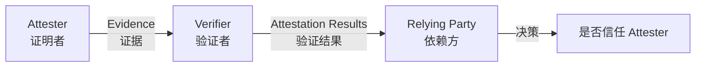
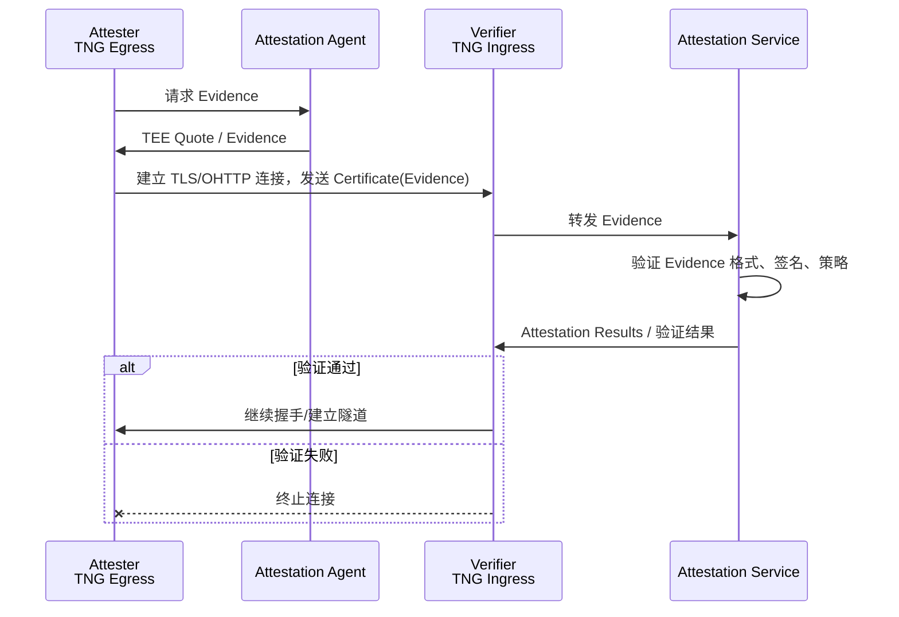
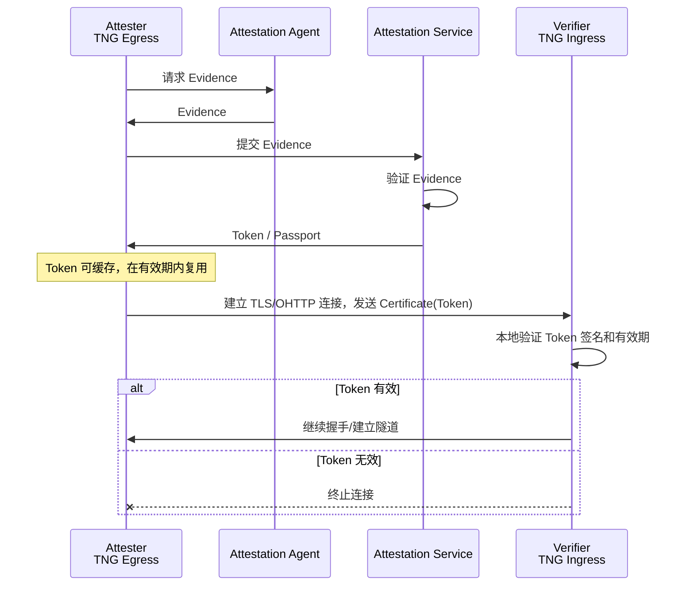
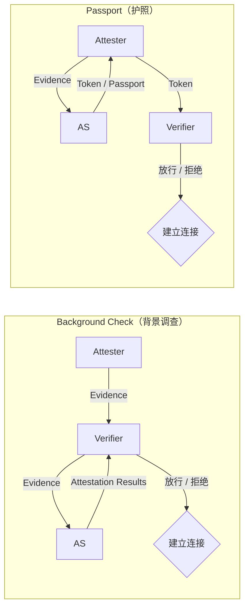

# 阶段二：远程证明基础

> 阅读材料：
> - `docs/architecture_zh.md` / `docs/architecture.md`
> - `docs/configuration_zh.md` / `docs/configuration.md`
> - `docs/scenarios/scenario_vllm_ohttp_cluster_zh.md`
> - `docs/scenarios/scenario_vllm_pd_separation_zh.md`
> - RFC 9334（RATS 架构）
>
> 目标：理解 RATS 模型、Attester/Verifier 角色、Background Check 与 Passport 两种模式，以及 TNG 中如何配置远程证明。

---

## 1. 一句话定义

远程证明（Remote Attestation）是可信计算的核心安全机制，允许一个系统向另一个系统证明：自己运行在真实、未被篡改的可信执行环境（TEE，Trusted Execution Environment）中。

`docs/architecture_zh.md` 的定义：

> 远程证明允许一方（证明者）向另一方（验证者）证明其硬件和软件环境的真实性及未被篡改。
>
> —— [`docs/architecture_zh.md` § 远程证明](../docs/architecture_zh.md)

在 TNG 中，远程证明发生在隧道建立之前：只有对端的 TEE 身份和运行环境通过验证，TLS/OHTTP 会话才会被建立。

---

## 2. RATS 模型中的角色

RATS（Remote ATtestation ProcedureS，远程证明流程/程序）是 IETF RFC 9334 定义的远程证明架构。TNG 的远程证明实现符合该架构。

### 2.1 三个核心角色

| 角色 | 英文 | 职责 | TNG 中通常由谁扮演 |
|---|---|---|---|
| **证明者** | Attester | 收集本地 TEE 的可信度量，生成 Evidence（证据） | Egress（服务端 TEE） |
| **验证者** | Verifier | 接收 Evidence，提交给 AS 验证，产生 Attestation Results | Ingress（客户端 TNG） |
| **依赖方** | Relying Party | 根据验证结果决定是否信任对端，并允许建立连接 | TNG 自身（根据验证结果放行/拒绝） |

### 2.2 TNG 中的角色简化

`docs/architecture_zh.md` 指出：

> TNG 在远程证明中扮演着核心角色，根据配置可以成为**证明者 (Attester)** 或 **验证者 (Verifier)**。
>
> 当 TNG 被配置为证明者角色时，它负责生成并提供其所在计算环境的“可信凭证”或“证据”（Evidence，证据）。
>
> 当 TNG 被配置为验证者角色时，它负责接收并严格审查来自对端 TNG (Attester) 提供的可信证据。
>
> —— [`docs/architecture_zh.md` § 远程证明](../docs/architecture_zh.md)

在典型的"用户 → 网关 → 推理 Pod"部署中：

| 链路 | Attester | Verifier |
|---|---|---|
| 用户 → 网关 | 网关 | 用户侧 TNG |
| 网关 → 推理 Pod | 推理 Pod | 网关侧 TNG |
| Pod ↔ Pod | 任意 Pod | 对端 Pod |

> 注意：如果启用**双向远程证明**，则每个 TNG 实例同时扮演 Attester 和 Verifier。

---

## 3. Evidence 与 Token 的流转

### 3.1 Evidence（证据）

Evidence 是由 Attester 生成的、描述其运行环境状态的密码学证据。它通常包含：

- TEE 平台信息（如 Intel TDX、AMD SEV-SNP）
- 硬件度量值（measurements）
- 启动时的软件组件哈希
- 运行时配置

`docs/configuration_zh.md` 中对 Attester 的描述：

> **Attester** 是被验证的一方，负责收集本地平台的可信状态信息并生成加密证据（Evidence）。
>
> —— [`docs/configuration_zh.md` § Attester 配置](../docs/configuration_zh.md)

### 3.2 Token（令牌）

Token 是 Attestation Service（AS，证明服务）对 Evidence 验证成功后签发的证明结果。在 Passport 模式下，Token 也被称为 Passport（护照）。

`docs/configuration_zh.md` 中对 Passport 的描述：

> 在 Passport 模式中，证明方（Attester）通过 Attestation Agent 获取证明，并将其提交给 Attestation Service 获取 Token（即 Passport）。验证方（Verifier）只需验证该 Token 的有效性，而无需直接与 Attestation Service 交互。
>
> —— [`docs/configuration_zh.md` § Passport 模式](../docs/configuration_zh.md)

### 3.3 Background Check 模式

`docs/configuration_zh.md` 原文：

> [Background Check](https://datatracker.ietf.org/doc/html/rfc9334#name-background-check-model) 是 TNG 默认的远程证明模式。证明方通过 Attestation Agent 获取证据，验证方直接验证。
>
> 未指定 `"model"` 字段时，TNG 自动使用 Background Check 模式。
>
> —— [`docs/configuration_zh.md` § Background Check 模式](../docs/configuration_zh.md)

数据流转：

特点：
- Verifier 直接与 AS 交互。
- 每次建立连接时，Verifier 都需要将 Evidence 发给 AS 验证（除非缓存）。
- 适用于 Verifier 能够访问 AS 的网络环境。

### 3.4 Passport 模式

`docs/configuration_zh.md` 原文：

> Passport 模式适用于网络隔离或性能要求较高的场景，因为它减少了验证方与 Attestation Service 之间的交互。
>
> —— [`docs/configuration_zh.md` § Passport 模式](../docs/configuration_zh.md)

数据流转：

特点：
- Attester 先向 AS 获取 Token，然后将 Token 交给 Verifier。
- Verifier 只需验证 Token 签名，不需要实时连接 AS。
- 适用于网络隔离、Verifier 无法直接访问 AS、或需要减少 AS 负载的场景。

### 3.5 Background Check vs Passport 对比

两种模式的核心差异可以用同一张图对比：

| 维度 | Background Check | Passport |

| 维度 | Background Check | Passport |
|---|---|---|
| **证据流转** | Attester → Verifier → AS | Attester → AS → Attester → Verifier |
| **Verifier 是否需要连接 AS** | 需要 | 不需要（只需验证 Token） |
| **AS 负载** | 高（每次连接都需验证） | 低（Token 可缓存复用） |
| **网络要求** | Verifier 必须能访问 AS | Verifier 可离线验证 Token |
| **适用场景** | Verifier 能直连 AS | 网络隔离、AS 负载敏感、Verifier 不可直连 AS |
| **TNG 默认模式** | ✅ 是 | 否 |
| **配置字段** | `attest` 省略 `model` 或设为 `background_check` | `attest.model = "passport"` |

---

## 4. TNG 中的关键组件

### 4.1 Attestation Agent（AA，证明代理）

`docs/architecture_zh.md` 描述：

> **Attestation Agent (AA)**：运行在 TEE（可信执行环境）内部的代理程序。AA 负责与底层的安全硬件（如 Intel TDX, AMD SEV-SNP, CSV 等）进行交互，收集原始可信度量数据，并将这些数据格式化为标准的“证据”，供 TNG 获取。
>
> —— [`docs/architecture_zh.md` § 证明者](../docs/architecture_zh.md)

AA 是 Attester 与 TEE 硬件之间的桥梁。TNG 不直接与 TEE 硬件交互，而是通过 AA 获取 Evidence。

### 4.2 Attestation Service（AS，证明服务）

`docs/architecture_zh.md` 描述：

> **Attestation Service (AS)**：这是一个独立的后端服务，通常运行在一个高度可信的环境中。AS 接收 TNG Verifier 转发来的可信证据，并对其进行深度的验证和解析。
>
> —— [`docs/architecture_zh.md` § 验证者](../docs/architecture_zh.md)

AS 的核心验证包括：
- 证据格式和签名验证
- 平台完整性度量验证
- 策略符合性检查

### 4.3 Provider 选择

`docs/configuration_zh.md` 原文：

> Attestation Agent 栈和 Attestation Service 栈分别通过 **`aa_provider`** 和 **`as_provider`** 进行选择。省略时默认为 **`"coco"`**（Confidential Containers）。
>
> | Provider | 用途 | 说明 |
> |---|---|---|
> | `"coco"` | `aa_provider` / `as_provider` | 默认。与 CoCo AA 和 CoCo AS 对接 |
> | `"ita"` | `aa_provider` / `as_provider` | 与 CoCo AA 对接收集证据，与 Intel Trust Authority 云服务对接验证 |
> | `"coco_asr"` | 仅 `aa_provider` | 通过 CoCo API Server Rest (ASR) HTTP 代理收集证据，适用于 TNG 运行在容器中无法直接访问 AA Unix socket |
> | `"ita_asr"` | 仅 `aa_provider` | 与 `"ita"` 相同，但通过 ASR HTTP 代理收集证据 |
>
> —— [`docs/configuration_zh.md` § Provider 选择](../docs/configuration_zh.md)

---

## 5. RATS-TLS 握手时的证据传递

在 RATS-TLS 模式下，Evidence/Token 被嵌入 TLS 1.3 握手过程中。具体时序见 [step-01-architecture-overview.md § 3.2 完整连接生命周期时序图](step-01-architecture-overview.md#32-加密链路)。

关键步骤：
1. Egress（Attester）通过 AA 获取 Evidence。
2. 在 TLS 握手时，Egress 将 Evidence/Token 嵌入 Certificate 消息。
3. Ingress（Verifier）将 Evidence 转发给 AS（Background Check）或验证 Token 签名（Passport）。
4. 验证通过后，TLS 会话建立；否则立即终止。

---

## 6. 配置入口速查

| 主题 | 文档位置 |
|---|---|
| Provider 选择 | [`docs/configuration_zh.md` § Provider 选择](../docs/configuration_zh.md) |
| Background Check Attest 配置 | [`docs/configuration_zh.md` § Background Check 模式](../docs/configuration_zh.md) |
| Passport Attest 配置 | [`docs/configuration_zh.md` § Passport 模式](../docs/configuration_zh.md) |
| Verifier 配置（Background Check） | [`docs/configuration_zh.md` § Verifier 配置](../docs/configuration_zh.md) |
| Builtin AS 配置 | [`docs/configuration_zh.md` § Builtin AS](../docs/configuration_zh.md) |
| OPA 策略配置 | [`docs/configuration_zh.md` § PolicyConfig](../docs/configuration_zh.md) |
| 参考值配置 | [`docs/configuration_zh.md` § ReferenceValueConfig](../docs/configuration_zh.md) |
| vLLM OHTTP 集群完整示例 | [`docs/scenarios/scenario_vllm_ohttp_cluster_zh.md`](../docs/scenarios/scenario_vllm_ohttp_cluster_zh.md) |
| vLLM P/D 分离完整示例 | [`docs/scenarios/scenario_vllm_pd_separation_zh.md`](../docs/scenarios/scenario_vllm_pd_separation_zh.md) |

---

## 7. 思考题

1. 在 TNG 中，为什么通常 Egress 作为 Attester、Ingress 作为 Verifier？什么情况下需要双向远程证明？
2. Background Check 和 Passport 模式的核心区别是什么？在什么场景下 Passport 更优？
3. AA 和 AS 分别扮演什么角色？如果 AS 被攻破，远程证明还安全吗？
4. 远程证明验证通过后，TLS 会话才建立。如果会话建立后 TEE 环境被篡改，RATS-TLS 能检测到吗？为什么？

---

## 8. 下一步

进入[阶段三：传输协议深度理解](step-03-transport-protocols.md)，重点理解 RATS-TLS 握手细节、OHTTP 密钥管理、以及 `peer_shared` 集群机制。
