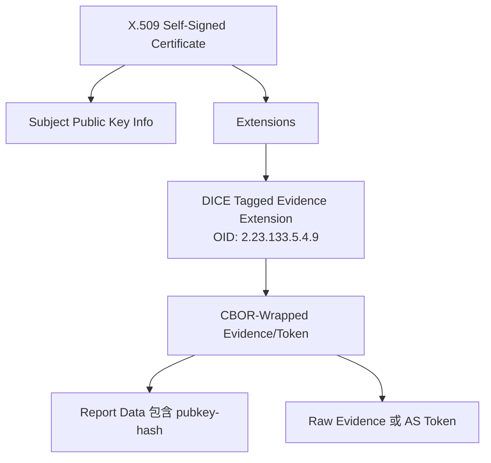
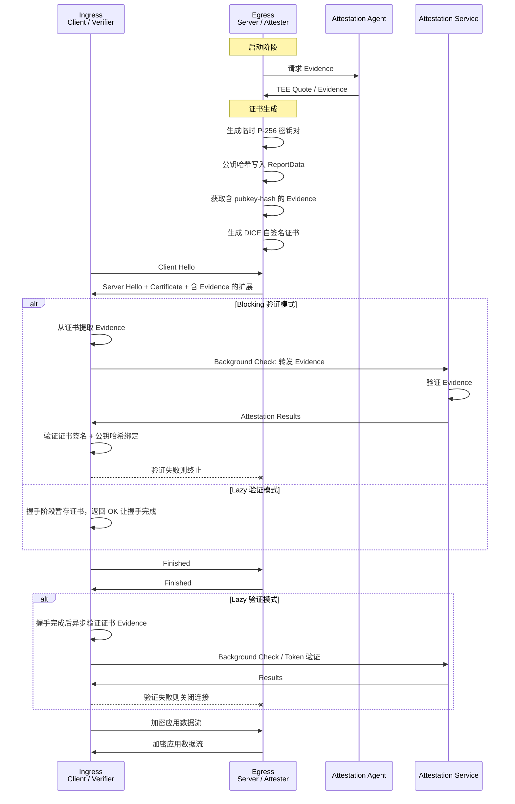
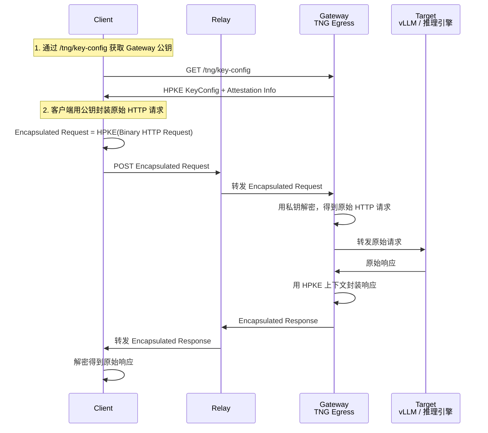
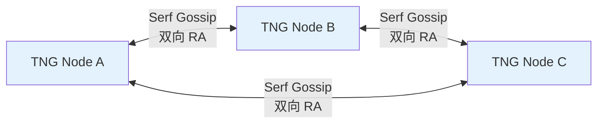
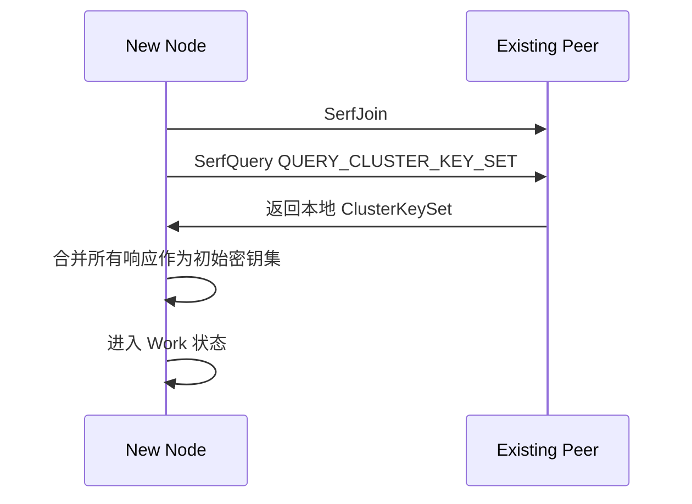

# 阶段三：传输协议深度理解

> 阅读材料：
> - `docs/architecture_zh.md` / `docs/architecture.md`
> - `docs/configuration_zh.md` / `docs/configuration.md`
> - `docs/peer_shared_zh.md` / `docs/peer_shared.md`
> - `tng/src/tunnel/utils/rustls/ra/`（RATS-TLS 实现）
> - `rats-cert/src/cert/`（DICE 证书生成与验证）
>
> 目标：理解 RATS-TLS 在 TLS 1.3 上的扩展、Evidence 如何嵌入证书、客户端如何验证服务端，以及 OHTTP 密钥管理和 peer_shared 集群机制。

---

## 1. RATS-TLS：TLS 1.3 + 远程证明

### 1.1 核心思想

RATS-TLS 不是替代 TLS，而是在标准 TLS 1.3 握手过程中融入远程证明证据。`docs/architecture_zh.md` 原文：

> 在标准的 TLS 1.3 协议握手过程中，融入了远程证明机制传递远程证明证据材料。只有当远程证明验证成功，证明对端的运行环境是真实且可信的时候，TLS 会话才会被正式建立或维持。
>
> —— [`docs/architecture_zh.md` § RATS-TLS](../docs/architecture_zh.md)

关键点：
- **传输层**：仍是 TLS 1.3，任意 TCP 流量都能透明保护。
- **身份层**：不依赖传统 CA，而是用 TEE Evidence/Token 证明对端身份。
- **绑定**：证书中的公钥与 Evidence 中的 `pubkey-hash` claim 绑定，防止中间人替换证书。

---

### 1.2 Evidence 如何嵌入证书

TNG 使用 **DICE（Device Identifier Composition Engine）** 格式的自签名 X.509 证书。Evidence 被放在 X.509 扩展中。

#### DICE 证书扩展

| 扩展 OID | 名称 | 用途 |
|---|---|---|
| `2.23.133.5.4.9` | `OID_TCG_DICE_TAGGED_EVIDENCE` | 携带 Evidence / Token |
| `2.23.133.5.4.2` | `OID_TCG_DICE_ENDORSEMENT_MANIFEST` | 预留，当前未使用 |

`rats-cert/src/cert/dice/extensions.rs` 中定义了这两个扩展。`rats-cert/src/cert/create.rs` 中的证书构建流程：

1. 生成临时密钥对（默认 P-256）。
2. 计算公钥哈希，作为自定义 claim `pubkey-hash` 写入 ReportData。
3. 通过 Attester 获取 Evidence，Evidence 中包含了带 `pubkey-hash` 的 ReportData。
4. 将 Evidence 打包成 CBOR 格式，放入 DICE Evidence 扩展。
5. 生成自签名 X.509 证书，有效期默认 6 小时。

代码注释也提到：

> Note: the implementation here is not compatible with the Interoperable RA-TLS now
>
> —— `rats-cert/src/cert/create.rs`

这说明当前 TNG 的 DICE 证书格式是其自有实现，尚未与某些 interoperable RA-TLS 标准兼容。

#### 证书结构示意



---

### 1.3 握手与验证流程

#### 完整时序



#### 为什么需要 Lazy 模式？

rustls 的证书验证回调 `verify_server_cert` / `verify_client_cert` 是**同步**的，但远程证明验证需要异步调用 Attestation Service（HTTP/gRPC）。因此 TNG 提供两种模式：

| 模式 | 验证时机 | 适用场景 | 风险 |
|---|---|---|---|
| **Blocking** | 握手过程中阻塞验证 | 验证耗时短、可接受握手延迟 | 阻塞 worker 线程 |
| **Lazy** | 握手完成后异步验证 | AS 调用慢、高并发 | 握手完成到验证完成之间数据可能已流动 |

`rats-cert` 验证流程（`tng/src/tunnel/utils/rustls/ra/common.rs`）：

1. 解析证书，验证自签名。
2. 从 DICE 扩展提取 CBOR Evidence/Token。
3. 计算证书公钥哈希，与 Evidence 中的 `pubkey-hash` claim 比对（防证书替换）。
4. Passport 模式：直接验证 AS Token。
5. Background Check 模式：通过 `converter` 将 Evidence 转成 Token，再用 `verifier` 验证。

---

### 1.4 Ingress 如何验证 Egress 身份

1. **证书自签名校验**：确认证书确实由证书中的公钥签名，防止伪造。
2. **Evidence 来源校验**：
   - Background Check：Evidence 经过 AS 验证，AS 用硬件厂商证书链验证 TEE Quote。
   - Passport：Token 由 AS 签名，Ingress 用 AS 公钥验证。
3. **公钥绑定校验**：证书公钥哈希必须匹配 Evidence/Token 中的 `pubkey-hash`，确保 TLS 会话密钥确实由该 TEE 生成。
4. **策略校验**：可选的 OPA policy、reference value 等进一步约束 TEE 度量值。

---

## 2. OHTTP：消息级加密与隐私保护

### 2.1 Oblivious HTTP 基本思想

OHTTP 是 RFC 9458 定义的消息级加密协议，核心目标：**让中间 Relay 看不到请求内容，让 Gateway 看不到客户端身份**。

参与角色：

| 角色 | 英文 | 职责 |
|---|---|---|
| 客户端 | Client | 构造原始 HTTP 请求，用 Gateway 公钥封装加密 |
| 中继 | Relay | 转发 Encapsulated Request，不知道内容 |
| 网关 | Gateway | 解密 Encapsulated Request，转发给 Target |
| 目标 | Target | 实际处理请求的后端服务 |

`docs/architecture_zh.md` 描述：

> OHTTP 能够将客户的 HTTP 请求和响应进行加密传输。如果与 OHTTP Relay 服务配合使用，使其转发加密的 TNG 请求，可以达到模糊请求来源，从而实现更强的用户隐私保护效果。
>
> —— [`docs/architecture_zh.md` § OHTTP](../docs/architecture_zh.md)

### 2.2 OHTTP 消息流程



### 2.3 Encapsulated Request 结构

根据 RFC 9458 §4.1：

```text
Encapsulated Request {
  Key Identifier (8),
  HPKE KEM ID (16),
  HPKE KDF ID (16),
  HPKE AEAD ID (16),
  Encapsulated KEM Shared Secret (8 * Nenc),
  HPKE-Protected Request (..),
}
```

中间 Relay 只能看到：
- Key ID（1 字节）
- KEM/KDF/AEAD 算法标识
- 加密后的 payload

看不到：Host、Path、Header、Body 等原始 HTTP 内容。

---

### 2.4 TNG 中 OHTTP 的密钥管理

`docs/configuration_zh.md` 中 TNG 支持三种 OHTTP 密钥管理策略。

#### self_generated 模式（默认）

> TNG 自主生成 HPKE 密钥对并自动轮换。
>
> —— [`docs/configuration_zh.md` § self_generated 模式](../docs/configuration_zh.md)

- 每个 TNG Egress 实例独立生成密钥。
- 适合单实例或后端固定路由场景。
- 客户端通过 `/tng/key-config` 获取公钥。

#### file 模式

> 从外部文件加载 OHTTP HPKE 私钥，适用于与外部密钥管理系统集成。
>
> —— [`docs/configuration_zh.md` § file 模式](../docs/configuration_zh.md)

- 私钥来自 PEM 文件，固定 key id = 0。
- 适合需要固定公钥、与外部 KMS 集成的场景。
- 文件变更时 TNG 通过 inotify 自动重载。

#### peer_shared 模式

> 多个 TNG 实例通过基于 Serf Gossip 协议的 QUIC 加密通道共享密钥，仅经远程证明验证的可信节点可参与密钥交换。
>
> —— [`docs/configuration_zh.md` § peer_shared 模式](../docs/configuration_zh.md)

这是 TNG 解决**多实例负载均衡**的关键机制。详见 [`docs/peer_shared_zh.md`](../docs/peer_shared_zh.md)。

---

### 2.5 peer_shared 集群机制详解

#### 为什么需要 peer_shared？

在无状态集群中，客户端每次请求可能到达任意节点。如果每个节点使用不同 OHTTP 密钥：

```text
Client 用 A 节点公钥加密 → Nginx 路由到 B 节点 → B 无法解密
```

`peer_shared` 让集群内所有节点共享同一套 OHTTP 私钥。

#### 三密钥状态

| 状态 | 说明 | 可解密 | 可公开给客户端 |
|---|---|---|---|
| Pending | 等待激活，已分发但尚未生效 | ✅ | ❌ |
| Active | 活跃状态，可给新客户端使用 | ✅ | ✅ |
| Stale | 已过期，仅用于解密旧连接 | ✅ | ❌ |

三状态设计实现**平滑轮换**：
- Pending 提前生成并广播，到期后统一切 Active。
- Active 过期后转 Stale，继续服务已缓存旧公钥的客户端一段时间。
- Stale 最终过期移除。

#### 去中心化 Gossip 同步



- 节点间通过 Serf 协议交换 ClusterKeySet。
- 节点间通信通过**双向远程证明**建立信任，只有可信节点能参与密钥共享。
- 不需要 Raft 等强一致性协议，因为可用性优先。

#### 主节点与密钥轮换

- **主节点**：节点 ID 最小的实例负责创建新的 Pending 密钥并广播。
- 主节点离开时，剩余节点中最小 ID 自动接管。
- 轮换间隔 `rotation_interval` 默认 300 秒。

#### 新节点加入



#### 未知密钥兜底

当节点收到用本地没有的公钥加密的请求时：

1. 发起 `SerfQuery(QUERY_KEY)` 向集群查询。
2. 拥有该密钥的节点返回 KeyInfo。
3. 发起节点插入本地 ClusterKeySet 后继续处理。

---

## 3. RATS-TLS 与 OHTTP 的关系

| 维度 | RATS-TLS | OHTTP |
|---|---|---|
| **层级** | TCP / 传输层 | HTTP / 消息层 |
| **工作方式** | 建立 TLS 隧道，透明转发任意 TCP | 逐条 HTTP 消息 HPKE 加密 |
| **远程证明** | 握手阶段通过 DICE 证书完成 | 通过 `/tng/key-config` 返回 Attestation Info |
| **中间节点可见性** | 完全不可见（密文流） | 只能看到 Key ID 等少量元数据 |
| **负载均衡** | 4 层 | 7 层（简单分发） |
| **连接复用** | 长连接、连接池 | 请求级无状态 |
| **TNG 中典型用法** | Pod ↔ Pod KV cache 传输 | 用户 → 网关 → 推理 Pod |

两者可以组合使用：

```text
用户 → (OHTTP) → Nginx 网关 → (OHTTP) → 推理 Pod
                                      ↓
                              Pod 内部/外部 RATS-TLS
                                      ↓
                                  其他 Pod
```

TNG 的 vLLM P/D 分离场景就是典型组合：
- 用户 → Proxy：OHTTP + 单向 RA
- Proxy → P/D 节点：OHTTP + 双向 RA
- P ↔ D KV cache：RATS-TLS + 双向 RA

---

## 4. 配置入口速查

| 主题 | 文档位置 |
|---|---|
| RATS-TLS 配置 | [`docs/configuration_zh.md` § RATS-TLS](../docs/configuration_zh.md) |
| OHTTP 配置 | [`docs/configuration_zh.md` § OHTTP](../docs/configuration_zh.md) |
| OHTTP 密钥管理 | [`docs/configuration_zh.md` § 密钥管理](../docs/configuration_zh.md) |
| peer_shared 协议细节 | [`docs/peer_shared_zh.md`](../docs/peer_shared_zh.md) |
| vLLM OHTTP 集群示例 | [`docs/scenarios/scenario_vllm_ohttp_cluster_zh.md`](../docs/scenarios/scenario_vllm_ohttp_cluster_zh.md) |
| vLLM P/D 分离示例 | [`docs/scenarios/scenario_vllm_pd_separation_zh.md`](../docs/scenarios/scenario_vllm_pd_separation_zh.md) |

---

## 5. 思考题

1. RATS-TLS 中，如果攻击者用自己的临时密钥生成证书，但没有真实 TEE Evidence，客户端会如何发现并拒绝？
2. Lazy 验证模式有什么优势和风险？什么时候应该用 Blocking，什么时候用 Lazy？
3. OHTTP 的 Gateway 是否必须是 TEE？Target 是否必须是 TEE？
4. peer_shared 模式中，如果两个节点同时启动且互不可见，各自生成不同密钥，后续如何收敛？
5. 为什么 OHTTP 适合放在 Nginx 等 7 层网关后面，而 RATS-TLS 更适合直连或 4 层负载均衡？

---

## 6. 下一步

进入[阶段四：配置方法实战](step-04-configuration.md)，重点理解 TNG 的 JSON 配置结构、字段含义和不同场景下的配置组合。
