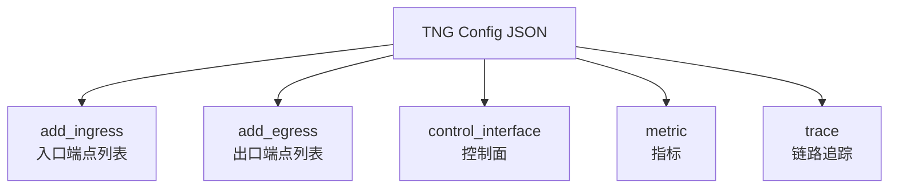
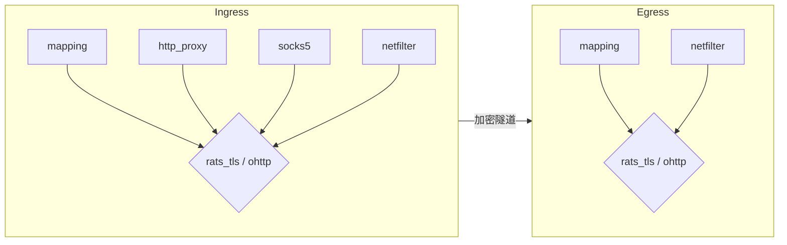

# 阶段四：配置方法实战

> 阅读材料：
> - `docs/configuration_zh.md` / `docs/configuration.md`
> - `docs/scenarios/` 下各场景示例
> - `dist/config.json`
> - `tng-python/README.md`（了解 SDK 如何封装配置）
>
> 目标：能独立阅读、编写和调试 TNG 的 JSON 配置，理解字段含义和相互依赖。

---

## 1. 顶层配置对象

TNG 的配置是一个 JSON 对象，顶层字段如下：

| 字段 | 类型 | 必填 | 说明 |
|---|---|---|---|
| `add_ingress` | array [[Ingress](#21-ingress)] | 否 | 隧道入口端点列表 |
| `add_egress` | array [[Egress](#22-egress)] | 否 | 隧道出口端点列表 |
| `control_interface` | object | 否 | 控制面 RESTful API |
| `metric` | object | 否 | Metrics 导出配置 |
| `trace` | object | 否 | OpenTelemetry trace 导出配置 |

日志通过 `RUST_LOG` 环境变量控制，不是 JSON 配置字段。

`add_ingress` 和 `add_egress` 至少有一个。一个 TNG 进程可以同时承担 Ingress 和 Egress 角色。



---

## 2. Ingress 与 Egress 通用结构

### 2.1 Ingress

Ingress 是流量**进入隧道**的一端。`docs/configuration_zh.md` 说明：

> "Ingress" 表示流量进入隧道，而非 Kubernetes Ingress 中的"入站服务器"含义。

Ingress 必须指定**入站模式** + **传输协议** + **远程证明角色**。

| 字段 | 类型 | 说明 |
|---|---|---|
| `mapping` / `http_proxy` / `socks5` / `netfilter` | object | 四选一，入站模式 |
| `rats_tls` / `ohttp` | object | 二选一，传输协议；默认 RATS-TLS |
| `attest` / `verify` | object | 远程证明角色，可共存实现双向 RA |
| `no_ra` | boolean | 调试用，禁用远程证明 |

### 2.2 Egress

Egress 是流量**流出隧道**的一端。

| 字段 | 类型 | 说明 |
|---|---|---|
| `mapping` / `netfilter` | object | 二选一，出站模式 |
| `rats_tls` / `ohttp` | object | 二选一，传输协议 |
| `attest` / `verify` | object | 远程证明角色 |
| `direct_forward` | array | 明文放行规则 |

### 2.3 模式与协议组合



---

## 3. 入站/出站模式详解

### 3.1 mapping 模式

**Ingress mapping**：监听本地端口，把流量加密后发往固定目标。

```json
{
    "add_ingress": [
        {
            "mapping": {
                "in": { "host": "0.0.0.0", "port": 10001 },
                "out": { "host": "127.0.0.1", "port": 20001 }
            },
            "verify": {
                "as_addr": "http://127.0.0.1:8080/",
                "policy_ids": ["default"]
            }
        }
    ]
}
```

**Egress mapping**：监听本地端口，解密后转发给本地服务。

```json
{
    "add_egress": [
        {
            "mapping": {
                "in": { "host": "127.0.0.1", "port": 20001 },
                "out": { "host": "127.0.0.1", "port": 30001 }
            },
            "attest": {
                "aa_addr": "unix:///run/confidential-containers/attestation-agent/attestation-agent.sock"
            }
        }
    ]
}
```

| 字段 | 必填 | 说明 |
|---|---|---|
| `in.host` | 否 | 监听地址，默认 `0.0.0.0` |
| `in.port` | 是 | 监听端口 |
| `out.host` | 是 | 目标地址 |
| `out.port` | 是 | 目标端口 |

### 3.2 http_proxy 模式

TNG 作为本地 HTTP 代理，客户端通过 `http_proxy` 环境变量或代理设置将流量导入。

```json
{
    "add_ingress": [
        {
            "http_proxy": {
                "proxy_listen": { "host": "0.0.0.0", "port": 41000 },
                "dst_filters": [
                    { "domain": "*", "port": 8080 }
                ]
            },
            "verify": {
                "as_addr": "http://127.0.0.1:8080/",
                "policy_ids": ["default"]
            }
        }
    ]
}
```

| 字段 | 说明 |
|---|---|
| `proxy_listen.host/port` | 代理监听地址/端口 |
| `dst_filters` | 仅匹配的请求进入隧道；不匹配走普通代理转发 |

### 3.3 netfilter 模式

通过 iptables/netfilter 透明捕获流量，无需修改客户端配置。

**Ingress netfilter**：捕获本地发出的流量。

```json
{
    "add_ingress": [
        {
            "netfilter": {
                "capture_dst": [
                    { "host": "192.168.1.0/24", "port": 30001 }
                ],
                "listen_port": 50000,
                "so_mark": 565
            },
            "verify": {
                "as_addr": "http://127.0.0.1:8080/",
                "policy_ids": ["default"]
            }
        }
    ]
}
```

**Egress netfilter**：捕获发往本机服务端口的入站流量。

```json
{
    "add_egress": [
        {
            "netfilter": {
                "capture_dst": [{ "port": 8080 }],
                "capture_local_traffic": true,
                "listen_port": 40000,
                "so_mark": 565
            },
            "attest": {
                "aa_addr": "unix:///run/confidential-containers/attestation-agent/attestation-agent.sock"
            }
        }
    ]
}
```

| 字段 | 说明 |
|---|---|
| `capture_dst` | 目标地址/端口捕获规则，支持 `host`、`ipset`、`port`、`port_end` |
| `capture_cgroup` | cgroup v2 路径，仅匹配这些 cgroup 的流量 |
| `nocapture_cgroup` | 排除的 cgroup 路径 |
| `capture_local_traffic` | 是否捕获源 IP 为本机的流量（Egress 常用） |
| `listen_port` | TNG 监听端口，接收被捕获的流量 |
| `so_mark` | 密文流量的 socket mark，防止回环 |

---

## 4. 远程证明配置

### 4.1 角色配置原则

| 场景 | Ingress | Egress |
|---|---|---|
| 单向 RA（客户端验证服务端） | `verify` | `attest` |
| 双向 RA（Mesh/Pod 间） | `attest` + `verify` | `attest` + `verify` |
| 调试用 | `no_ra: true` | `no_ra: true` |

> [!WARNING]
> `no_ra` 不可与 `attest`/`verify` 共存，且仅用于调试，不可用于生产。

### 4.2 Provider 选择

`docs/configuration_zh.md` 原文：

> Attestation Agent 栈和 Attestation Service 栈分别通过 `aa_provider` 和 `as_provider` 进行选择。省略时默认为 `"coco"`。

| Provider | 用途 | 适用场景 |
|---|---|---|
| `"coco"` | `aa_provider` / `as_provider` | 默认，对接 CoCo AA/AS |
| `"ita"` | `aa_provider` / `as_provider` | 对接 Intel Trust Authority |
| `"coco_asr"` | 仅 `aa_provider` | TNG 在容器中，通过 HTTP 代理访问 AA |
| `"ita_asr"` | 仅 `aa_provider` | 通过 ASR 代理访问 AA |

### 4.3 Background Check 模式

Attest 配置示例：

```json
{
    "attest": {
        "aa_type": "uds",
        "aa_addr": "unix:///run/confidential-containers/attestation-agent/attestation-agent.sock",
        "refresh_interval": 3600
    }
}
```

Verify 配置示例：

```json
{
    "verify": {
        "as_addr": "http://127.0.0.1:8080/",
        "policy_ids": ["default"]
    }
}
```

### 4.4 Passport 模式

Attest 配置示例：

```json
{
    "attest": {
        "model": "passport",
        "aa_type": "uds",
        "aa_addr": "unix:///run/confidential-containers/attestation-agent/attestation-agent.sock",
        "as_type": "restful",
        "as_addr": "http://127.0.0.1:8080/",
        "policy_ids": ["default"]
    }
}
```

Verify 配置示例：

```json
{
    "verify": {
        "model": "passport",
        "policy_ids": ["default"]
    }
}
```

### 4.5 Builtin AS

无需外部 AS，TNG 本地直接验证 Evidence。

```json
{
    "verify": {
        "as_type": "builtin",
        "attestation_policy": { "type": "default" },
        "reference_values": []
    }
}
```

> [!NOTE]
> Builtin AS 需要在编译时启用对应 TEE 特性（`builtin-as-tdx`、`builtin-as-sgx`、`builtin-as-snp`），GitHub CI 构建的 RPM/二进制产物不支持，仅容器镜像支持。

---

## 5. OHTTP 配置

### 5.1 Ingress 侧

Ingress 侧 OHTTP 配置通常为空对象或省略 `key` 字段，由客户端自动从服务端获取公钥。

```json
{
    "add_ingress": [
        {
            "http_proxy": {
                "proxy_listen": { "host": "0.0.0.0", "port": 41000 }
            },
            "ohttp": {},
            "verify": {
                "as_addr": "http://127.0.0.1:8080/",
                "policy_ids": ["default"]
            }
        }
    ]
}
```

### 5.2 Egress 侧密钥管理

#### self_generated 模式

```json
{
    "ohttp": {
        "key": {
            "source": "self_generated",
            "rotation_interval": 300
        }
    }
}
```

#### peer_shared 模式

```json
{
    "ohttp": {
        "key": {
            "source": "peer_shared",
            "rotation_interval": 300,
            "host": "0.0.0.0",
            "port": 8301,
            "peers": ["192.168.10.1:8301"],
            "attest": {
                "aa_addr": "unix:///run/confidential-containers/attestation-agent/attestation-agent.sock"
            },
            "verify": {
                "as_addr": "http://as.example.com:8080/",
                "policy_ids": ["default"]
            }
        }
    }
}
```

#### file 模式

```json
{
    "ohttp": {
        "key": {
            "source": "file",
            "path": "/etc/tng/ohttp-key.pem"
        }
    }
}
```

---

## 6. 可观测性配置

### 6.1 Metrics

`docs/configuration.md` 说明 TNG 暴露以下指标：

| Scope | Name | Type | Description |
|---|---|---|---|
| Instance | `live` | Gauge | `1` indicates instance is alive and healthy |
| ingress/egress | `tx_bytes_total` | Counter | Total bytes sent |
| ingress/egress | `rx_bytes_total` | Counter | Total bytes received |
| ingress/egress | `cx_active` | Gauge | Currently active connections |
| ingress/egress | `cx_total` | Counter | Total connections |
| ingress/egress | `cx_failed` | Counter | Total failed connections |

支持通过 `otlp`、`falcon`、`stdout` 三种导出器上报：

```json
{
    "metric": {
        "exporters": [
            {
                "type": "stdout",
                "step": 60
            }
        ]
    }
}
```

### 6.2 Log

日志**不是 JSON 配置字段**，而是通过 `RUST_LOG` 环境变量控制。`docs/configuration.md` 原文：

> TNG outputs logs to standard output by default. Control the log level via the `RUST_LOG` environment variable: `error`, `warn`, `info`, `debug`, `trace`, `off`. Default is `info`, with all third-party library logs disabled.

例如：

```bash
RUST_LOG=info tng launch --config-file config.json
```

### 6.3 Tracing

```json
{
    "trace": {
        "exporters": [
            {
                "type": "otlp",
                "protocol": "grpc",
                "endpoint": "http://127.0.0.1:4317"
            }
        ]
    }
}
```

---

## 7. 配置依赖关系

```mermaid
graph TD
    subgraph "必须同时配置"
        A[Ingress 传输协议] --> B[Egress 传输协议]
        B --> A
    end

    subgraph "角色配对"
        C[Ingress verify] --> D[Egress attest]
        E[Ingress attest] --> F[Egress verify]
    end

    subgraph "互斥关系"
        G[rats_tls] -.x.-> H[ohttp]
        I[attest] -.x.-> J[no_ra]
        K[verify] -.x.-> J
    end
```

关键依赖：
1. Ingress 和 Egress 的传输协议必须一致（都用 RATS-TLS 或都用 OHTTP）。
2. 如果 Ingress 配置了 `verify`，Egress 必须配置 `attest`。
3. `rats_tls` 和 `ohttp` 在同一端点中互斥。
4. `no_ra` 与 `attest`/`verify` 互斥。

---

## 8. 配置文件示例

本阶段配套配置文件放在 [`configs/`](configs/) 目录下：

| 文件 | 场景 | 关键配置 |
|---|---|---|
| [`configs/01-http-proxy-single.json`](configs/01-http-proxy-single.json) | HTTP 代理访问单机 TEE 服务 | `http_proxy` + `netfilter` + 单向 RA |
| [`configs/02-vllm-ohttp-cluster-egress.json`](configs/02-vllm-ohttp-cluster-egress.json) | vLLM OHTTP 集群 Egress | `netfilter` + `ohttp.peer_shared` + 双向 RA |
| [`configs/03-vllm-ohttp-cluster-ingress.json`](configs/03-vllm-ohttp-cluster-ingress.json) | vLLM OHTTP 集群 Ingress | `http_proxy` + `ohttp` + `verify` |
| [`configs/04-mesh-two-way-ra.json`](configs/04-mesh-two-way-ra.json) | Mesh 节点双向 RA | `netfilter` + `attest` + `verify` |
| [`configs/05-control-interface-metrics.json`](configs/05-control-interface-metrics.json) | 控制面 + OTLP metrics | `control_interface` + `metric` + `trace` |

---

## 9. 常见配置错误

| 错误 | 原因 | 解决 |
|---|---|---|
| `ohttp` 和 `rats_tls` 同时配置 | 互斥 | 只保留一个 |
| Ingress 配 `verify` 但 Egress 没配 `attest` | 角色不配对 | Egress 增加 `attest` |
| `no_ra` 与 `attest` 共存 | 互斥 | 删除 `no_ra` 或删除 `attest`/`verify` |
| `builtin` AS 在 RPM 包中不可用 | 编译特性未启用 | 使用容器镜像或外部 AS |
| netfilter 捕获不到本机流量 | 没开 `capture_local_traffic` | Egress netfilter 设置 `capture_local_traffic: true` |
| OHTTP 客户端提示 key 不存在 | Egress 端密钥未同步 | 检查 peer_shared 集群是否形成 |

---

## 10. 思考题

1. 同一个 TNG 进程能否同时作为 Ingress 和 Egress？什么场景需要这样配置？
2. 为什么 `http_proxy` 模式的 `dst_filters` 中 `domain: "*"` 可以匹配所有域名，但 `socks5` 模式下域名过滤可能失效？
3. `attest.refresh_interval` 和 OHTTP `key.rotation_interval` 分别控制什么？两者有什么关系？
4. 在什么场景下应该选择 Passport 模式而不是 Background Check 模式？
5. 如果要在 Kubernetes 中部署 TNG Egress 作为 DaemonSet，应该注意哪些配置字段？

---

## 11. 下一步

进入[阶段五：部署与运维视角](step-05-deployment.md)，理解 systemd、Docker、RPM 三种部署形态和可观测性配置。
