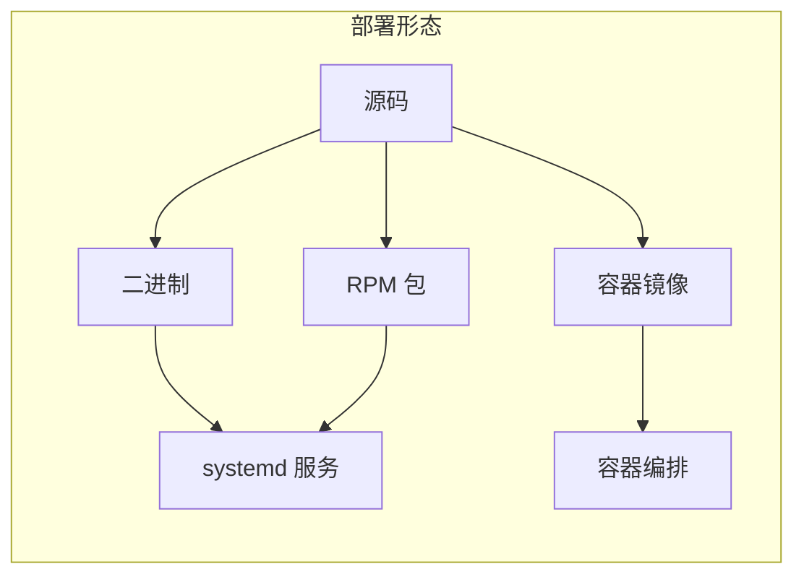

# 阶段五：部署与运维视角

> 阅读材料：
> - `dist/trusted-network-gateway.service`
> - `Dockerfile`
> - `trusted-network-gateway.spec`
> - `Makefile`
> - `docs/configuration.md` / `docs/configuration_zh.md` 中 Observability 章节
>
> 目标：理解 TNG 在真实基础设施中的部署形态、构建方式和可观测性配置。

---

## 1. TNG 的三种部署形态

TNG（Trusted Network Gateway，可信网络网关，Trusted 可信的、Network 网络、Gateway 网关） 是一个独立的 Rust 二进制程序。根据运行环境不同，项目官方提供了三种交付形态：

| 形态 | 适用场景 | 启动方式 | 配置位置 |
|---|---|---|---|
| **二进制 + systemd** | 物理机 / 虚拟机 / 云主机 | `systemctl start trusted-network-gateway` | `/etc/tng/config.json` |
| **容器镜像** | Kubernetes / Podman / Docker 环境 | `docker run tng:<version>` | 挂载或环境变量注入 |
| **RPM 包** | AnolisOS / RHEL / CentOS 系发行版 | `yum install trusted-network-gateway` | 与 systemd 一致 |



### 1.1 systemd 服务

`dist/trusted-network-gateway.service` 原文：

```ini
[Unit]
Description=Trusted Network Gateway Daemon
Documentation=https://github.com/inclavare-containers/tng/blob/master/docs/configuration.md
After=network.target

[Service]
ExecStart=/usr/bin/tng launch --config-file /etc/tng/config.json
Restart=always

[Install]
WantedBy=multi-user.target
```

补充说明：
- `After=network.target` 保证网络就绪后再启动 TNG。
- `Restart=always` 让 TNG 在崩溃或退出后自动拉起，适合长驻服务。
- 配置文件固定为 `/etc/tng/config.json`，与 RPM 安装路径一致。
- 需要 root 或 `CAP_NET_ADMIN` 才能使用 netfilter 模式；systemd 中可通过 `AmbientCapabilities=CAP_NET_ADMIN` 配置。

### 1.2 Docker 容器

`Dockerfile` 采用多阶段构建：

1. **builder 阶段**：安装 Rust 工具链、protobuf、gcc、Intel TDX DCAP 等依赖，编译带 `builtin-as-tdx` 特性的 TNG 二进制。
2. **release 阶段**：仅保留运行时依赖（`iptables`、`iproute`、Intel DCAP 库等）和编译好的 `tng` 二进制。

关键片段原文：

```dockerfile
RUN . "$HOME/.cargo/env" && env RUSTFLAGS="--cfg tokio_unstable" cargo install --locked --features 'builtin-as-tdx' --path ./tng/ --root /usr/local/cargo/
```

```dockerfile
RUN yum install -y curl iptables iproute && yum clean all
```

补充说明：
- 默认入口是 `CMD ["tng"]`，实际运行时需要覆盖为 `tng launch --config-file /path/to/config.json`。
- 容器必须授予 `NET_ADMIN` capability，netfilter 模式才能操作 iptables。
- `builtin-as-tdx` 特性使镜像内置 TDX 证明服务（AS），适合需要本地验证证据的场景。

### 1.3 RPM 包

`trusted-network-gateway.spec` 关键内容：

```spec
Requires: curl iptables openssl iproute
Recommends: attestation-agent

%files
/usr/bin/tng
/usr/lib/systemd/system/trusted-network-gateway.service
%dir /etc/tng/
/etc/tng/config.json
```

补充说明：
- RPM 安装后，直接获得二进制、systemd unit 和默认配置。
- `Requires` 列出了运行 TNG 的最低系统依赖。
- `Recommends: attestation-agent` 表示推荐安装证明代理（Attestation Agent，Attestation 证明、Agent 代理），用于生成 TEE 证据。
- 默认 spec 构建时不带 `builtin-as-tdx`，需要本地验证请选择容器镜像或自行编译。

---

## 2. 部署方式对比

```mermaid
graph TD
    subgraph 物理机/VM
        S1[用户] -->|HTTP/RATS-TLS/OHTTP| S2[tng 进程<br/>systemd 托管]
        S2 -->|明文/隧道| S3[TEE 内服务]
    end

    subgraph Kubernetes
        K1[用户] -->|Ingress| K2[Istio Gateway]
        K2 --> K3[tng sidecar<br/>容器镜像]
        K3 --> K4[TEE 内 Pod]
    end

    subgraph 传统包管理
        R1[yum install] --> R2[trusted-network-gateway RPM]
        R2 --> R3[systemctl start]
        R3 --> R4[/etc/tng/config.json]
    end
```

| 维度 | systemd / RPM | Docker / Podman | 备注 |
|---|---|---|---|
| 网络权限 | 需 root 或 `CAP_NET_ADMIN` | 需 `--cap-add NET_ADMIN` | netfilter 模式必需 |
| 配置管理 | 固定 `/etc/tng/config.json` | ConfigMap / 挂载 / 环境变量 | 容器更灵活 |
| 证明代理 | 宿主机安装 attestation-agent | 通常 sidecar 或宿主机映射 | 影响 `attest.aa_addr` |
| 升级方式 | `yum update` 或替换二进制 | 滚动更新镜像 Tag | 容器更适合灰度 |
| 调试便利 | 直接看 journalctl | docker logs / kubectl logs | 两者都支持结构化日志 |

---

## 3. 可观测性配置

TNG 的可观测性（Observability，Observability 可观察性） 分为三个层面：日志（Log）、指标（Metric）和链路追踪（Trace）。此外还提供控制面 RESTful API 供健康检查。

### 3.1 Log

`docs/configuration.md` 原文：

> TNG outputs logs to standard output by default. Control the log level via the `RUST_LOG` environment variable: `error`, `warn`, `info`, `debug`, `trace`, `off`. Default is `info`, with all third-party library logs disabled.

补充说明：
- 日志默认输出到标准输出，便于容器和 systemd 统一收集。
- `RUST_LOG` 支持更复杂的过滤规则，例如 `RUST_LOG=tng=debug,hyper=warn`。
- 生产环境建议 `info` 或 `warn`，调试时可用 `debug`。

### 3.2 Metric

`docs/configuration.md` 原文指标列表：

| Scope | Name | Type | Description |
|---|---|---|---|
| Instance | `live` | Gauge | `1` indicates instance is alive and healthy |
| ingress/egress | `tx_bytes_total` | Counter | Total bytes sent |
| ingress/egress | `rx_bytes_total` | Counter | Total bytes received |
| ingress/egress | `cx_active` | Gauge | Currently active connections |
| ingress/egress | `cx_total` | Counter | Total connections |
| ingress/egress | `cx_failed` | Counter | Total failed connections |

支持三种导出器（Exporter，Exporter 导出器）：

| Type | 字段 | 用途 |
|---|---|---|
| `otlp` | `protocol`, `endpoint`, `headers`, `step` | 对接 OpenTelemetry Collector |
| `falcon` | `server_url`, `endpoint`, `tags`, `step` | 对接 Open-Falcon 监控 |
| `stdout` | `step` | 直接打印到标准输出 |

OTLP 示例：

```json
{
    "metric": {
        "exporters": [
            {
                "type": "otlp",
                "protocol": "http/protobuf",
                "endpoint": "https://otlp.example.com/url",
                "headers": { "Authorization": "XXXXXXXXX" },
                "step": 60
            }
        ]
    }
}
```

补充说明：
- `step` 是采集周期，单位秒，默认 60。
- 指标标签会自动带上 ingress/egress 的 ID、类型和监听地址，便于定位问题。

### 3.3 Trace

`docs/configuration.md` 原文：

> Supports OpenTelemetry standard tracing export.

支持两种导出器：

| Type | 字段 | 用途 |
|---|---|---|
| `otlp` | `protocol`, `endpoint`, `headers` | 对接 OTLP Collector |
| `stdout` | 无 | 同步输出，仅调试 |

示例：

```json
{
    "tracing": {
        "exporters": [
            {
                "type": "otlp",
                "protocol": "http/protobuf",
                "endpoint": "https://otlp.example.com/url"
            }
        ]
    }
}
```

补充说明：
- `stdout` 在高并发下会显著影响性能，生产环境请用 `otlp`。
- 链路追踪对排查隧道握手失败、远程证明超时特别有用。

### 3.4 Control Interface

`docs/configuration.md` 原文：

| Endpoint | Description |
|---|---|
| `/livez` | Liveness check; returns `200 OK` indicating the instance is running |
| `/readyz` | Readiness check; returns `200 OK` indicating the instance can handle traffic |

配置示例：

```json
{
    "control_interface": {
        "restful": {
            "host": "0.0.0.0",
            "port": 50000
        }
    }
}
```

补充说明：
- `/livez` 用于判断进程是否存活；`/readyz` 用于判断是否可以接受流量。
- Kubernetes 中可配置为 livenessProbe 和 readinessProbe。
- 控制面端口不应直接暴露给公网，建议通过 Service Mesh 或防火墙限制访问。

---

## 4. 常用构建命令

`Makefile` 中常用目标：

| 命令 | 作用 |
|---|---|
| `make bin-build` | 编译 release 二进制到 `target/release/tng` |
| `make docker-build` | 构建容器镜像 `tng:<version>` |
| `make create-tarball` | 生成 RPM 构建所需的 vendored 源码包 |
| `make rpm-build` | 构建 RPM 包 |
| `make run-test` | 运行集成测试套件 |
| `make bench` | 对比 raw TCP / stunnel / TNG 的性能 |

关键命令原文：

```makefile
bin-build:
	RUSTFLAGS="--cfg tokio_unstable" cargo build --release
```

```makefile
docker-build:
	docker build -t tng:${VERSION} .
```

```makefile
rpm-build:
	rpmbuild -ba ./trusted-network-gateway.spec --define 'with_rustup 1'
```

补充说明：
- 所有构建都需要 `RUSTFLAGS="--cfg tokio_unstable"`，这是 TNG 对 Tokio 不稳定特性的依赖。
- RPM 构建依赖 `rpmdevtools`、`yum-builddep` 和 `rpmbuild`。
- `create-tarball` 会调用 `cargo +nightly-2025-07-07 vendor`，需要 nightly 工具链。

---

## 5. 生产部署 checklist

| 检查项 | 说明 |
|---|---|
| 配置文件语法校验 | 先用 `tng launch --config-file config.json --dry-run` 校验（如支持）或小流量验证 |
| 网络权限 | 确认 TNG 进程有 `CAP_NET_ADMIN`，netfilter 模式才能工作 |
| 远程证明 | 生产禁用 `no_ra`，正确配置 `attest` / `verify` 和 AS/AA 地址 |
| 密钥/证书 | OHTTP 模式下确保证书、密钥、peer_shared 配置正确同步 |
| 可观测性 | 配置 metrics exporter、RUST_LOG、控制面 `/livez` / `/readyz` |
| 高可用 | 多实例部署时考虑无状态配置，避免单点 |
| 安全暴露 | 控制面端口不直接暴露公网；RATS-TLS/OHTTP 端口按需开放 |

---

## 6. 思考题

1. **systemd 方式下，如何在不重启服务的情况下更新 TNG 配置？**
2. **容器环境中，netfilter 模式需要哪些额外权限或参数？**
3. **如果只配置了 `metrics.stdout`，在高并发场景下可能带来什么风险？**
4. **`/livez` 和 `/readyz` 在 Kubernetes 中分别对应哪个探针？**
5. **RPM 包和容器镜像在 `builtin-as-tdx` 支持上有何差异？**
